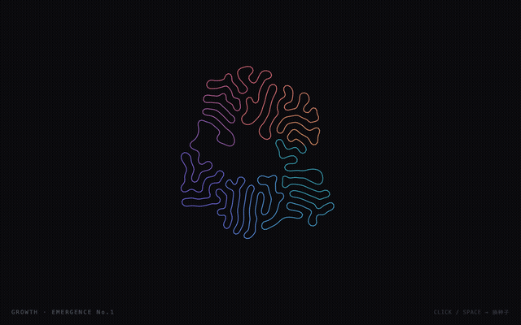
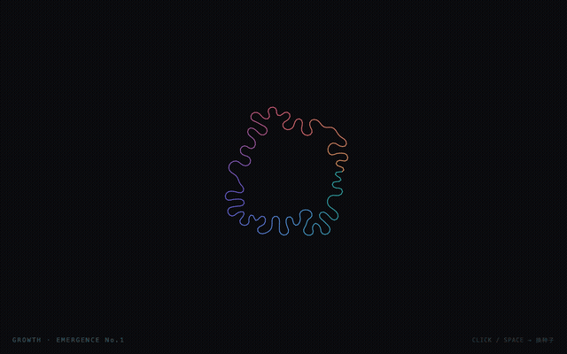
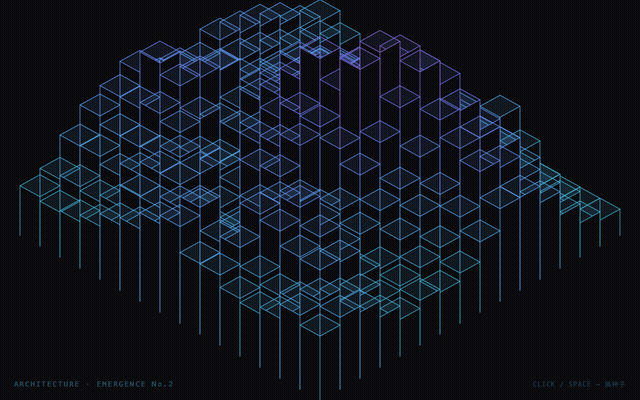
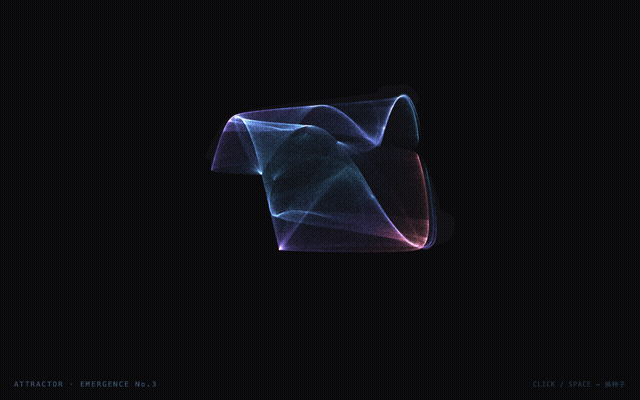

# EMERGENCE

生成艺术系列 · "简单规则长出复杂形态"。每件一个算法，种子驱动、可复现、单文件（p5.js 走 CDN，需联网）。

视觉语言统一：近黑底 `#0b0b0e` + 同一渐变色谱（青→蓝→紫→粉→橙）+ 角落签名。每件 **点击 / 空格 = 换种子重生成**。

🔗 **在线演示**：https://jada-q.github.io/emergence/



> 三件依次：生长 → 构造 → 吸引子（循环）。

## 演示（实时动态）

> 以下为单件录屏 GIF（循环）。打开[在线演示](https://jada-q.github.io/emergence/)可交互、换种子。

**No.1 · GROWTH** — 差分生长，一条闭合线实时折叠成有机网


**No.2 · ARCHITECTURE** — 等距结构塔群随时间缓慢起伏


**No.3 · ATTRACTOR** — de Jong 参数漂移使数学丝缦流动变形


## 三件

| # | 文件 | 算法 | 形态 | 状态 |
|---|------|------|------|------|
| No.1 | `01-growth.html` | 差分生长 Differential Growth | 网（线）| **实时生长**，约 50 秒长满 15000 节点 |
| No.2 | `02-architecture.html` | 生成构造 Generative Architecture | 塔（体）| **实时**，塔群随时间缓慢起伏，自动垂直居中 |
| No.3 | `03-attractor.html` | 奇异吸引子 de Jong Attractor | 缦（点）| **实时**，参数缓慢漂移使丝缦流动变形（带拖尾残影）|

## 算法简述

- **No.1 差分生长**：一条闭合线，每点被邻居拉住保持间距、又被附近点排斥避免自交，线变长就插新点 → 无法自交只能向内折叠，长成脑回/珊瑚纹。软边界让它碰边回弹而非压平。
- **No.2 生成构造**：等距投影网格，每格塔高由 Perlin 噪声 + 径向衰减决定，后→前绘制做遮挡，发光边线按高度上色。
- **No.3 奇异吸引子**：de Jong 公式 `x'=sin(a·y)−cos(b·x)` / `y'=sin(c·x)−cos(d·y)` 迭代百万次，点按移动速度上色。自动排除"坍缩成一点"的退化参数。

## 技术栈

刻意做薄：单文件、零构建、零依赖（仅一个 CDN 库）。

| 层 | 用什么 | 说明 |
|----|--------|------|
| 绘图库 | **p5.js** `1.9.0`（CDN） | Processing 的 JS 版，提供 canvas 封装 + `setup()`/`draw()` 生命周期 + 噪声/随机/颜色工具 |
| 渲染 | **HTML Canvas 2D** | p5 底层即浏览器原生 canvas，所有线/点/方块画于此 |
| 语言 | **纯 JavaScript** | 无框架（无 React/Vue）、无打包工具（无 Webpack/Vite），每件一个 `.html` |
| 复现 | **seeded 随机** | `randomSeed` / `noiseSeed` + **Perlin 噪声** `noise()` → 同种子同图，可复现 |
| 演示托管 | **GitHub Pages** | 静态托管，零服务器 |
| README 动图 | **headless Chrome + ffmpeg** | puppeteer-core 录帧 → ffmpeg `palettegen` 合成防色带 loop GIF |

各件用到的算法/技巧：

- **No.1**：自定义物理模拟（邻居吸引 + 排斥力 + 空间哈希网格加速碰撞查询）
- **No.2**：等距投影（isometric）数学 + 后→前画家算法做遮挡
- **No.3**：de Jong 迭代公式 + `blendMode(ADD)` 加色辉光 + 拖尾残影

> 为什么这么薄：生成艺术的甜区就是 p5.js，三个小作品不必上 React/Three.js 重型栈。单文件无依赖 = 拖进浏览器即跑，十年后也不会因构建工具过时而坏。

## 运行

任一 html 直接拖进浏览器即可（file:// 也行）。或本地起 server：

```bash
cd ~/Desktop/Projects/emergence
python3 -m http.server 8000
# 浏览器开 http://localhost:8000/01-growth.html
```

## 待办 / 可扩展

- 三件均为实时动态（No.2 塔群起伏 / No.3 丝缦漂移 / No.1 生长）。
- 曾试过 No.4 反应扩散（Gray-Scott），因柔边质感与系列不统一 + 计算卡顿，已弃。
- 配色 / 密度 / 构图均可调（见各文件顶部参数注释）。
